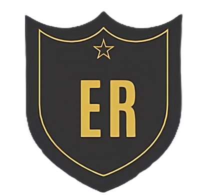

<p align="center">
  
</p>

<h1 align="center">Serralheiro Eduardo Rodrigues</h1>

<h2 align="center">
  <a href="https://eduardo-rodrigues-serralheiro.vercel.app/" target="_blank">
    🔗 Acesse o site
  </a>
</p>

## 📋 Descrição

Projeto desenvolvido para o **Serralheiro Eduardo Rodrigues**, com o objetivo de concentrar seus canais de contato e apresentar seus serviços de forma clara e profissional.  
O site busca **facilitar o acesso dos clientes** e **fortalecer a presença digital** do profissional, destacando seu portfólio e formas de contato.


## 🚀 Funcionalidades

- 📱 Acesso rápido aos principais projetos e canais de contato  
- 🌐 Layout responsivo para diferentes dispositivos  
- 🔗 Integração com **WhatsApp** 
- 🎨 Interface moderna e intuitiva  


## 🛠️ Tecnologias utilizadas

- **HTML5**  
- **CSS3 (TailwindCSS)**  
- **JavaScript**


## 💻 Hospedagem

O projeto está hospedado na plataforma **Vercel**, garantindo deploy contínuo e alta disponibilidade.

🔗 [Acesse o site clicando aqui](https://eduardo-rodrigues-serralheiro.vercel.app/)


## 📊 Status do projeto

✅ **Concluído**

---

## 🏷️ Badges


## 📂 Estrutura do projeto

```bash
assets/
├── icons/              # Ícones e favicons do site
js/
├── main.js             # Script principal
src/
├── img/                # Imagens do site (logo, portfólio, banners, etc.)
│   └── logo.png
index.html              # Página principal
